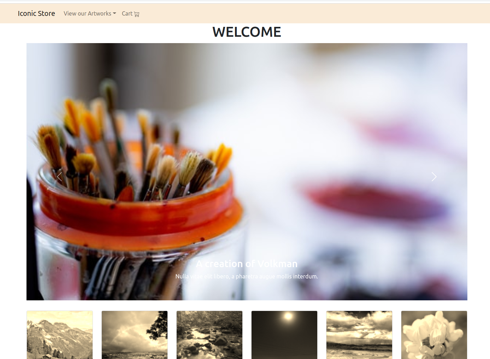

<!-- PROJECT LOGO -->
<br />
<p align="center">
 <a href="https://angelospa.github.io/iconic-store-redux/">
    
  </a>

  <h2 align="center">ONLINE-SHOP-GALLERY</h2>

  <p align="center">
    I created this imaginary e-commerce website as an example of Redux state container
    <br />
    <a href="https://github.com/AngelosPa/iconic-store-redux/tree/main/src"><strong>Explore the files »</strong></a>
    <br />
    <br />
    <a href="https://angelospa.github.io/iconic-store-redux/">View Demo</a>
    ·
    <a href="https://github.com/github_username/repo_name/issues">Report Bug</a>
    ·
    <a href="https://github.com/github_username/repo_name/issues">Request Feature</a>
  </p>
</p>

<!-- TABLE OF CONTENTS -->
<details open="open">
  <summary><h2 style="display: inline-block">Table of Contents</h2></summary>
  <ol>
    <li>
      <a href="#about-the-project">About The Project</a>
      <ul>
        <li><a href="#built-with">Built With</a></li>
      </ul>
    </li>
    <li>
      <a href="#getting-started">Getting Started</a>
      <ul>
        <li><a href="#prerequisites">Prerequisites</a></li>
        <li><a href="#installation">Installation</a></li>
      </ul>
    </li>
    <li><a href="#usage">Usage</a></li>
    <li><a href="#roadmap">Roadmap</a></li>
    <li><a href="#contributing">Contributing</a></li>
    <li><a href="#license">License</a></li>
    <li><a href="#contact">Contact</a></li>
    <li><a href="#acknowledgements">Acknowledgements</a></li>
  </ol>
</details>

<!-- ABOUT THE PROJECT -->

## About The Project

This is an Gallery-online store that created in order to present an example of Redux library for managing application state.It contains the basic actions of 'add to card" , "remove','checkout" and also a slider

### Built With

- [React](https://reactjs.org/)
- [Sass](https://sass-lang.com/)

- [Redux](https://redux.js.org/introduction/getting-started)
- [Unsplash](https://unsplash.com/)

<!-- GETTING STARTED -->

## Getting Started

To get a local copy up and running follow these simple steps.

### Prerequisites

You need to make sure you machine has NPM installed and up to date.

- npm
  ```sh
  npm install
  ```

### Installation

1. Clone the repo
   ```sh
   git clone https://angelospa.github.io/iconic-store-redux/ <your directory name>
   ```
2. Move in the cloned repository
   ```sh
   cd <your directory name>
   ```
3. Download NPM packages

   ```sh
   3.1 npm install node-sass
   3.2 npm install react-router-dom
   3.3 npm install npm i react-redux
   3.4 npm install react-bootstrap bootstrap
   3.5 npm install faker
   ```

4. Run the application
   ```sh
   npm start
   ```

<!-- ROADMAP -->

## Roadmap

I would be thrilled to have you following us along the process to make this application even better.I would like to let you know that we have some changes coming up, as we learn more about backend and database. Some of the features to be included:

- "subscribe to our page" feature
- log-in log-out function

<!-- CONTRIBUTING -->

## Contributing

Contributions are what make the open source community such an amazing place to be learn, inspire, and create. Any contributions you make are **greatly appreciated**.

1. Fork the Project
2. Create your Feature Branch (`git checkout -b feature/AmazingFeature`)
3. Commit your Changes (`git commit -m 'Add some AmazingFeature'`)
4. Push to the Branch (`git push origin feature/AmazingFeature`)
5. Open a Pull Request

<!-- LICENSE -->

## License

Distributed under the MIT License. See `LICENSE` for more information.

<!-- CONTACT -->

## Contact

Angelos Papagiannopoulos - [github page](https://github.com/AngelosPa) - mrpalaiologos@gmail.com

<!-- ACKNOWLEDGEMENTS -->

## Acknowledgements

- [Hadi Nsreeny](https://github.com/hnsreeny), our amazing web dev teacher and mentor.

<!-- MARKDOWN LINKS & IMAGES -->
<!-- https://www.markdownguide.org/basic-syntax/#reference-style-links -->

[contributors-shield]: https://img.shields.io/github/contributors/hamzadarej/social-network?style=for-the-badge
[contributors-url]: https://github.com/github_username/repo/graphs/contributors
[forks-shield]: https://img.shields.io/github/forks/github_username/repo.svg?style=for-the-badge
[forks-url]: https://github.com/github_username/repo/network/members
[stars-shield]: https://img.shields.io/github/stars/github_username/repo.svg?style=for-the-badge
[stars-url]: https://github.com/github_username/repo/stargazers
[issues-shield]: https://img.shields.io/github/issues/github_username/repo.svg?style=for-the-badge
[issues-url]: https://github.com/github_username/repo/issues
[license-shield]: https://img.shields.io/github/license/github_username/repo.svg?style=for-the-badge
[license-url]: https://github.com/github_username/repo/blob/master/LICENSE.txt
[linkedin-shield]: https://img.shields.io/badge/-LinkedIn-black.svg?style=for-the-badge&logo=linkedin&colorB=555
[linkedin-url]: https://linkedin.com/in/github_username
